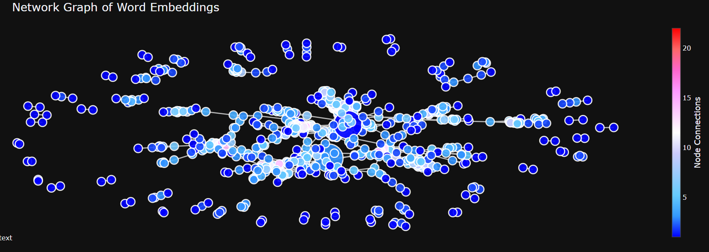

# Word Embeddings for Ingredients using Word2Vec
This project visualizes word embeddings generated for a dataset of ingredients using Word2Vec. The visualization is displayed as an interactive graph where ingredients are represented as nodes, and connections between them signify their proximity in the embedding space. The closer two nodes are, the more semantically similar the corresponding ingredients are.

## Ingredient Word Embeddings Visualization
### Key Features
 * Interactive Plot: Hover over any point to reveal the corresponding ingredient name.
 * Zoom Capability: Zoom in to explore clusters of ingredients and their relationships in more detail.
 * Network Graph: Colors indicate the number of node connections, with a heatmap legend on the side to interpret the connection density.
 * The interactive visualization can be accessed [here](). You can interact with the plot directly by hovering over the points to display the ingredient names and zooming in to explore clusters in greater detail.

### Example Visualization

In the example above, the nodes represent different ingredients.

